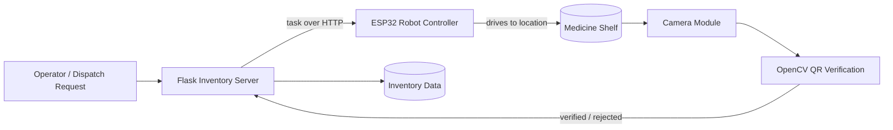

<div align="center">

# MAVIS
### Medical Autonomous Vision Inventory System

**An IoT-enabled autonomous medical logistics robot that navigates, verifies, and dispatches medicines using ESP32 firmware, Flask inventory services, and OpenCV QR-code verification.**


</div>

---

## Table of Contents

1. [Overview](#overview)
2. [Key Features](#key-features)
3. [System Architecture](#system-architecture)
4. [Repository Structure](#repository-structure)
5. [Technology Stack](#technology-stack)
6. [Getting Started](#getting-started)
7. [Usage](#usage)
8. [Testing](#testing)
9. [Configuration](#configuration)
10. [Safety and Regulatory Notice](#safety-and-regulatory-notice)
11. [Roadmap](#roadmap)
12. [Contributing](#contributing)
13. [License](#license)
14. [Author](#author)

---

## Overview

Hospitals and pharmacies lose time and accuracy to manual medicine retrieval, hand-written stock logs, and dispatch errors. **MAVIS** addresses this with an autonomous robot that closes the loop between *inventory data*, *physical movement*, and *visual verification*.

A request is placed through the inventory server. The robot, driven by an ESP32 controller, navigates to the correct storage location. A camera reads the QR code on the medicine container, and OpenCV confirms it matches the requested item **before** the dispatch is recorded and the stock count is updated.

**Why it matters**

| Problem | MAVIS approach |
|---|---|
| Manual retrieval is slow and labour-intensive | Autonomous ESP32-based navigation |
| Wrong-medicine errors | QR-code verification at the point of pickup |
| Stale or inaccurate stock records | Real-time inventory updates through a Flask backend |
| Poor traceability | Every dispatch is logged against a verified scan |

---

## Key Features

- **Autonomous navigation** powered by ESP32 firmware for motor control and movement.
- **Vision-based verification** using OpenCV to detect and decode QR codes on medicine containers.
- **Inventory management service** built on Flask, exposing a REST-style interface for stock and dispatch operations.
- **IoT communication** between the robot and the server over Wi-Fi using HTTP.
- **Modular repository** separating firmware, hardware, software, data, documentation, and tests.
- **Open-source** under the MIT License.

---

## System Architecture



**Workflow**

1. A dispatch request for a specific medicine is submitted to the Flask server.
2. The server looks up the item and its storage location in the inventory data.
3. The ESP32-controlled robot receives the task and navigates to the location.
4. The camera captures the container and OpenCV decodes the QR code.
5. The decoded ID is compared with the requested item.
6. On a match, the dispatch is confirmed and the stock level is updated. On a mismatch, the action is rejected and flagged.

> The diagram reflects the system design described in the project summary. Adjust component names to match your final implementation.

---

## Repository Structure

```text
MAVIS-Medical-Autonomous-Vision-Inventory-System/
├── data/            # Inventory datasets and sample records
├── docs/            # Project documentation, diagrams, and reports
├── firmware/
│   └── esp32/       # ESP32 firmware for navigation and actuation
├── hardware/        # Hardware design: wiring, schematics, bill of materials
├── software/        # Flask server and OpenCV vision modules
├── tests/           # Automated tests
├── .gitignore
├── LICENSE.md       # MIT License
├── README.md
└── requirements.txt # Python dependencies
```

---

## Technology Stack

| Layer | Technology |
|---|---|
| Microcontroller firmware | ESP32 (C/C++, Arduino framework or ESP-IDF) |
| Backend / inventory API | Python, Flask (3.x) |
| Computer vision | OpenCV (`opencv-python` 4.8+), NumPy |
| Device communication | HTTP via `requests` |
| Version control | Git and GitHub |

**Python dependencies** (from `requirements.txt`)

```text
Flask>=3.0,<4.0
requests>=2.31,<3.0
opencv-python>=4.8,<5.0
numpy>=1.24,<3.0
```

---

## Getting Started

### Prerequisites

- Python 3.9 or later
- `pip` and `venv`
- An ESP32 development board and a toolchain to flash it (Arduino IDE, PlatformIO, or ESP-IDF)
- A camera (USB webcam or ESP32-CAM) for QR scanning
- Robot chassis, motor driver, and motors as listed in [`hardware/`](hardware/)

### 1. Clone the repository

```bash
git clone https://github.com/yashthakare-07/MAVIS-Medical-Autonomous-Vision-Inventory-System.git
cd MAVIS-Medical-Autonomous-Vision-Inventory-System
```

### 2. Set up the Python environment

```bash
python -m venv .venv

# Linux / macOS
source .venv/bin/activate

# Windows
.venv\Scripts\activate

pip install -r requirements.txt
```

### 3. Flash the ESP32 firmware

1. Open the project in [`firmware/esp32/`](firmware/esp32/) with your preferred toolchain.
2. Set your Wi-Fi credentials and the server address (see [Configuration](#configuration)).
3. Select the correct board and port, then build and upload.

### 4. Assemble the hardware

Follow the wiring diagrams and parts list in [`hardware/`](hardware/).

---

## Usage


**Start the inventory server**

```bash
cd software
python app.py
```

The server runs on `http://localhost:5000` by default.

**Run the QR verification module**

```bash
python qr_verify.py
```

**Typical operation**

1. Power on the robot and confirm it connects to the network.
2. Start the Flask server.
3. Submit a dispatch request for a medicine.
4. The robot navigates to the shelf and scans the container.
5. Review the verification result and updated stock in the server log or dashboard.

---

## Testing

```bash
pip install pytest
pytest tests/
```

Tests cover the software components. Hardware-in-the-loop checks should be performed separately on the physical robot.

---

## Configuration

Keep secrets and environment-specific values out of version control.

| Setting | Description | Example |
|---|---|---|
| `WIFI_SSID` / `WIFI_PASSWORD` | Network credentials for the ESP32 | set in firmware config |
| `SERVER_URL` | Address of the Flask server | `http://192.168.1.10:5000` |
| `CAMERA_INDEX` | Camera device used for QR scanning | `0` |

Use environment variables or an untracked config file (already covered by `.gitignore` where applicable).

---

## Safety and Regulatory Notice

MAVIS is a **research and educational prototype**. It is **not** a certified medical device and must not be used to handle or dispense real medication to patients without proper validation, regulatory review, and clinical oversight. Any real-world deployment would require compliance with applicable healthcare, data-protection, and device-safety regulations.

---

## Roadmap

- [ ] Obstacle avoidance and improved path planning
- [ ] Web dashboard for live inventory and robot status
- [ ] Persistent database (SQLite or PostgreSQL) in place of file-based data
- [ ] Authentication and role-based access for the API
- [ ] Expiry-date and batch tracking
- [ ] Multi-robot coordination
- [ ] CI pipeline with automated tests

---

## Contributing

Contributions are welcome.

1. Fork the repository.
2. Create a feature branch: `git checkout -b feature/your-feature`
3. Commit your changes: `git commit -m "Add your feature"`
4. Push the branch: `git push origin feature/your-feature`
5. Open a pull request describing the change.

Please keep changes focused, document new modules, and add tests where practical.

---

## License

Distributed under the **MIT License**. See [`LICENSE.md`](LICENSE.md) for details.

---

## Author

**Yash Thakare**
GitHub: [@yashthakare-07](https://github.com/yashthakare-07)

If you find this project useful, consider giving it a star.
